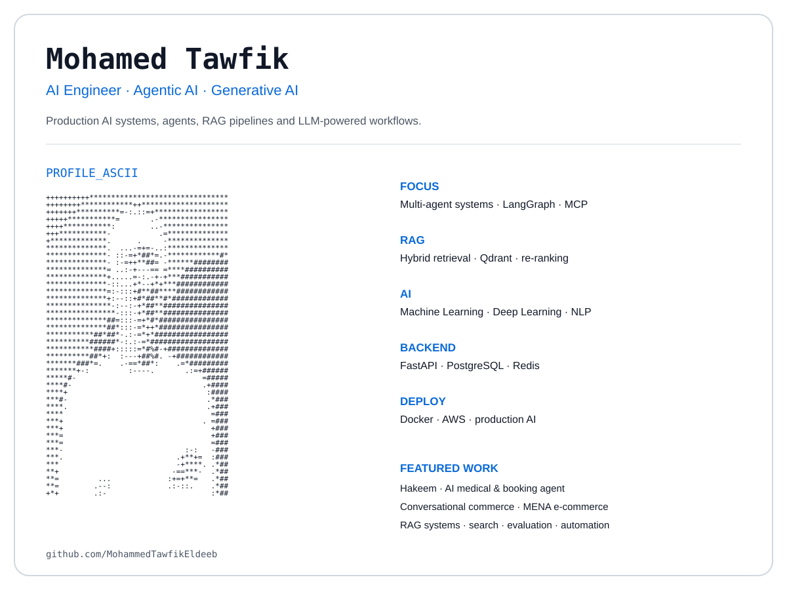

<picture>
  <source media="(prefers-color-scheme: dark)" srcset="./dark_mode.svg">
  <source media="(prefers-color-scheme: light)" srcset="./light_mode.svg">
  
</picture>

 

## About

**AI Engineer & Software Engineer**

Generative AI · Agentic AI · RAG · Backend Engineering · MLOps

---

## Languages

---

## AI / LLM

`LangChain` · `LangGraph` · `OpenAI` · `Gemini` · `Groq` · `Hugging Face` · `Transformers` · `MCP` · `LlamaIndex` · `Llama.cpp` · `Unsloth`

---

## Backend

`REST APIs` · `WebSockets` · `SSE` · `Pydantic` · `SQLAlchemy` · `Drizzle ORM`

---

## Databases & Retrieval

`Qdrant` · `PGVector` · `Pinecone` · `FAISS` · `ChromaDB` · `Neo4j` · `BM25` · `RRF` · `Cross-Encoder` · `Semantic Search`

---

## Cloud & MLOps

`SageMaker` · `MLflow` · `DVC` · `ZenML` · `Prefect` · `Opik`

---

## Education

**B.Sc. Computer Engineering — Tanta University**  
2021 – 2026 · A+ / Excellent

**Microsoft Machine Learning Professional Diploma — DEPI**  
2024

---

  

---

&nbsp;&nbsp;

